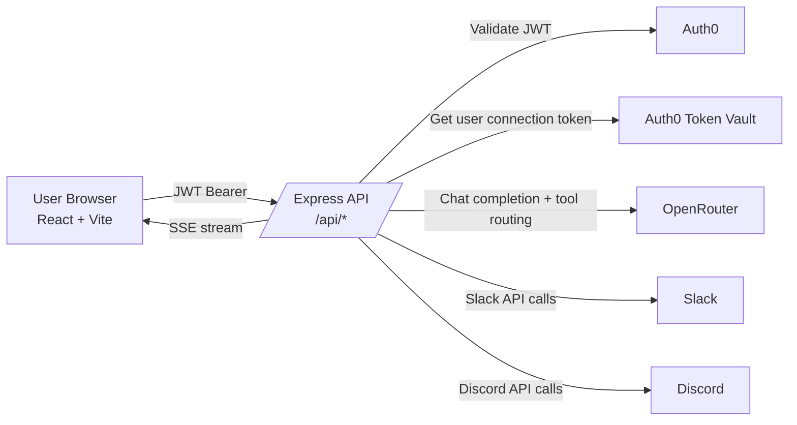
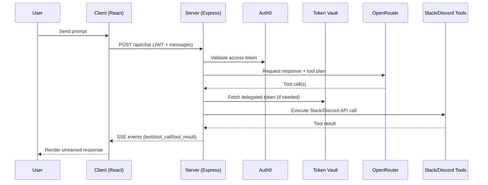

# Delegate Complete Documentation

## 1) Project Summary

Delegate is an AI assistant for Slack and Discord with Auth0-based authentication and Auth0 Token Vault for delegated access.

Core goals:

- Authenticate users securely
- Let users connect Slack/Discord accounts through Auth0
- Allow AI-driven read/post operations with least-privilege tokens
- Stream tool and model output to the UI in real time

---

## 2) System Architecture



### Runtime flow



---

## 3) Repository Directory Structure

```text
delegate/
├── api/
│   ├── index.ts
│   └── [...path].ts
├── client/
│   ├── index.html
│   ├── package.json
│   ├── vite.config.ts
│   ├── .env
│   ├── .env.example
│   └── src/
│       ├── App.tsx
│       ├── index.css
│       ├── main.tsx
│       ├── vite-env.d.ts
│       └── hooks/
│           └── useAgent.ts
├── server/
│   ├── package.json
│   ├── tsconfig.json
│   ├── .env
│   ├── .env.example
│   └── src/
│       ├── index.ts
│       ├── agents/
│       │   └── delegate.ts
│       ├── lib/
│       │   └── vault.ts
│       ├── routes/
│       │   └── agent.ts
│       └── tools/
│           ├── slack.ts
│           ├── discord.ts
│           └── notion.ts
├── README.md
├── PROJECT_DOCUMENTATION.md
├── COMPLETE_DOCUMENTATION.md
├── package.json
├── package-lock.json
└── vercel.json
```

---

## 4) API Reference

Base path: `/api`

### 4.1 Health

- **GET** `/api/health`
- Auth: none
- Purpose: service liveness
- Response example:

```json
{
  "status": "ok",
  "timestamp": "2026-04-05T20:00:00.000Z"
}
```

### 4.2 Connections

- **GET** `/api/connections`
- Auth: required (`Authorization: Bearer <Auth0 access token>`)
- Purpose: returns whether user has connected Slack/Discord via Token Vault identities
- Response example:

```json
{
  "connections": [
    { "connection": "slack", "connected": true },
    { "connection": "discord", "connected": false }
  ]
}
```

### 4.3 Chat (SSE)

- **POST** `/api/chat`
- Auth: required
- Purpose: run agent loop and stream events
- Request example:

```json
{
  "messages": [
    { "role": "user", "content": "Summarize my Discord activity" }
  ],
  "context": {
    "service": "discord",
    "workspaceId": "optional",
    "channelId": "optional"
  }
}
```

- Streamed event types:
  - `text`
  - `tool_call`
  - `tool_result`
  - `tool_error`
  - `auth_required`
  - `done`

SSE line format:

```text
data: {"type":"text","text":"..."}

```

---

## 5) Tooling and Integrations

### Slack tools

- `slack_list_channels`
- `slack_get_messages`
- `slack_post_message`

### Discord tools

- `discord_list_servers`
- `discord_get_messages`
- `discord_post_message`
- `discord_get_server_info`

### Token behavior

- Slack actions use delegated user tokens from Token Vault
- Discord API tools use bot token for server actions in current implementation
- Connection badges in UI are based on Auth0 identity/token presence

---

## 6) Environment Variables

### 6.1 Server (`server/.env`)

- `AUTH0_DOMAIN`
- `AUTH0_AUDIENCE`
- `AUTH0_CONNECTION_SLACK`
- `AUTH0_CONNECTION_DISCORD`
- `AUTH0_MGMT_TOKEN` (optional if using M2M)
- `AUTH0_M2M_CLIENT_ID`
- `AUTH0_M2M_CLIENT_SECRET`
- `AUTH0_VAULT_DEBUG`
- `OPENROUTER_API_KEY`
- `SLACK_CLIENT_ID`
- `SLACK_CLIENT_SECRET`
- `SLACK_SIGNING_SECRET`
- `SLACK_APP_TOKEN`
- `DISCORD_CLIENT_ID`
- `DISCORD_CLIENT_SECRET`
- `DISCORD_BOT_TOKEN`
- `PORT`
- `CLIENT_URL`
- `NODE_ENV`

### 6.2 Client (`client/.env`)

- `VITE_AUTH0_DOMAIN`
- `VITE_AUTH0_CLIENT_ID`
- `VITE_AUTH0_AUDIENCE`
- `VITE_API_URL`
- `VITE_AUTH0_CONNECTION_SLACK`
- `VITE_AUTH0_CONNECTION_NOTION`
- `VITE_AUTH0_CONNECTION_DISCORD`

---

## 7) Local Installation and Usage

### 7.1 Install

```bash
npm install
```

### 7.2 Configure env files

Create/update:

- `server/.env`
- `client/.env`

### 7.3 Run dev

```bash
npm run dev
```

Local URLs:

- Frontend: `http://localhost:5173`
- Backend: `http://localhost:3001`

### 7.4 Build

```bash
npm run build
```

---

## 8) Deployment (Vercel)

Current configuration in `vercel.json`:

- install command with dev dependencies
- build command for workspace
- output directory set to `client/dist`
- API functions configured under `api/**/*.ts`

### Production checklist

1. Set production env vars in correct Vercel project
2. Use production domain in `CLIENT_URL`
3. Use production frontend/API URLs in `VITE_*` values
4. Ensure Auth0 SPA app includes production callback/logout/web origin URLs
5. Ensure Auth0 Slack/Discord connections are enabled for SPA app

---

## 9) Common Problems and Fixes

### 9.1 `/api/chat` 404

- Cause: API route mapping not deployed
- Fix: verify `api/[...path].ts` and `vercel.json` are in deployed branch

### 9.2 `invalid_request` during connect

- Cause: Auth0 connection not enabled or wrong connection name
- Fix: enable connection for SPA app and match env connection name exactly

### 9.3 Build exits with code 127

- Cause: missing build tools in CI install context
- Fix: ensure install/build commands and workspace dependency install are correct

### 9.4 Discord works in tools but shows disconnected badge

- Cause: bot token actions succeed, but Auth0 user identity/token state is not connected
- Fix: complete Auth0 Discord OAuth flow and verify identity token presence

---

## 10) Security Practices

- Never commit `.env` files
- Keep secrets server-side
- Rotate leaked credentials immediately
- Use M2M for Auth0 management token flow in production
- Keep `AUTH0_VAULT_DEBUG=false` in production

---

## 11) Future Improvements

- Add explicit API docs schema (OpenAPI)
- Add end-to-end integration tests for auth and streaming
- Add richer role/permission modeling per connected service
- Add explicit bot-connected vs vault-connected UI status split
